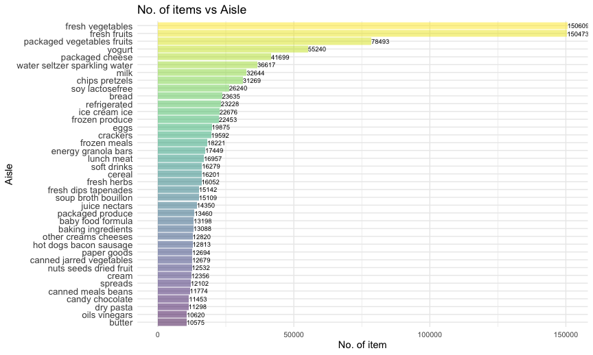
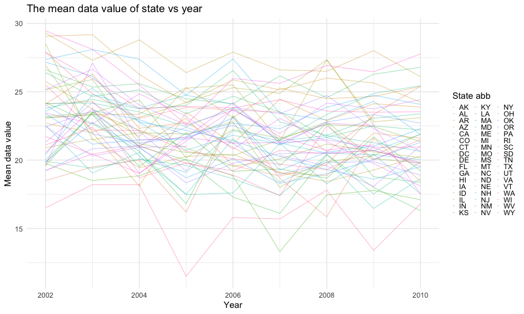
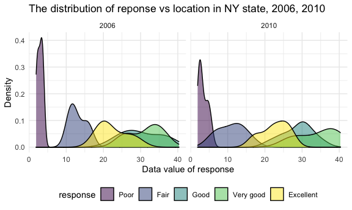

P8105_hw4_hc3212
================
Hening cui
2021/10/14

## Homework 3

## Problem 1

**Load and describe instacart data set.**

``` r
data("instacart")
```

The instacart data set contains 1384617 observations and 15 variables.
The data set is in a “long” format.The variable contains
add_to_cart_order, aisle, aisle_id, days_since_prior_order, department,
department_id, eval_set, order_dow, order_hour_of_day, order_id,
order_number, product_id, product_name, reordered, user_id. Every user
has an unique user id, and each order has an unique order id. Every
product was assigned a product id, the aisle together with aisle id
showed the category of product. Product belongs to different department
and could distinguished by department id. Reorder indicated whether the
product has been ordered before, with 1 means yes, 0 means no. Order dow
and order hour of day means at which hour in the weekday it was ordered.
Take row one as an example.

| order_id | product_id | add_to_cart_order | reordered | user_id | eval_set | order_number | order_dow | order_hour_of_day | days_since_prior_order | product_name                                  | aisle_id | department_id | aisle                | department   |
|---------:|-----------:|------------------:|----------:|--------:|:---------|-------------:|----------:|------------------:|-----------------------:|:----------------------------------------------|---------:|--------------:|:---------------------|:-------------|
|        1 |      49302 |                 1 |         1 |  112108 | train    |            4 |         4 |                10 |                      9 | Bulgarian Yogurt                              |      120 |            16 | yogurt               | dairy eggs   |
|        1 |      11109 |                 2 |         1 |  112108 | train    |            4 |         4 |                10 |                      9 | Organic 4% Milk Fat Whole Milk Cottage Cheese |      108 |            16 | other creams cheeses | dairy eggs   |
|        1 |      10246 |                 3 |         0 |  112108 | train    |            4 |         4 |                10 |                      9 | Organic Celery Hearts                         |       83 |             4 | fresh vegetables     | produce      |
|        1 |      49683 |                 4 |         0 |  112108 | train    |            4 |         4 |                10 |                      9 | Cucumber Kirby                                |       83 |             4 | fresh vegetables     | produce      |
|        1 |      43633 |                 5 |         1 |  112108 | train    |            4 |         4 |                10 |                      9 | Lightly Smoked Sardines in Olive Oil          |       95 |            15 | canned meat seafood  | canned goods |
|        1 |      13176 |                 6 |         0 |  112108 | train    |            4 |         4 |                10 |                      9 | Bag of Organic Bananas                        |       24 |             4 | fresh fruits         | produce      |

Row one means in order 1, user 112108 add 4 boxes of Bulgarian yogurt
first in to the cart. This product was also ordered 10 days before.
Bulgarian yogurt was identified as 49302 and belongs to yogurt category
(id 120) in dairy eggs department (id 16). The order was at 10 o’clock
in Thursday.

**How many aisles are there, and which aisles are the most items ordered
from?**

``` r
instacart %>% 
  pull(aisle_id) %>% 
  n_distinct()
```

    ## [1] 134

``` r
instacart %>% 
  group_by(aisle_id, aisle) %>% 
  summarize(n_item = n()) %>% 
  arrange(desc(n_item))
```

    ## `summarise()` has grouped output by 'aisle_id'. You can override using the `.groups` argument.

    ## # A tibble: 134 × 3
    ## # Groups:   aisle_id [134]
    ##    aisle_id aisle                         n_item
    ##       <int> <chr>                          <int>
    ##  1       83 fresh vegetables              150609
    ##  2       24 fresh fruits                  150473
    ##  3      123 packaged vegetables fruits     78493
    ##  4      120 yogurt                         55240
    ##  5       21 packaged cheese                41699
    ##  6      115 water seltzer sparkling water  36617
    ##  7       84 milk                           32644
    ##  8      107 chips pretzels                 31269
    ##  9       91 soy lactosefree                26240
    ## 10      112 bread                          23635
    ## # … with 124 more rows

There totally 134 aisles, fresh_vegetables(id:83) had most items ordered
from.

**Make a plot that shows the number of items ordered in each aisle,
limiting this to aisles with more than 10000 items ordered. Arrange
aisles sensibly, and organize your plot so others can read it.**

``` r
instacart %>% 
  group_by(aisle_id, aisle) %>% 
  summarize(n_item = n()) %>% 
  filter(n_item > 10000) %>% 
  arrange(desc(n_item)) %>% 
  ggplot() +
  geom_bar(aes(x = n_item, y = aisle, fill = aisle),stat = 'identity', alpha = 0.5) +
  labs(
    title = "No. of items vs Aisle",
    y = "Aisle", 
    x = "No. of item",
  ) +
  scale_x_continuous( 
    breaks = c(10000, 20000, 40000, 80000, 120000)
    ) +
  theme(
    legend.position = 'none',
    axis.text.y = element_text(size = 6),
    axis.text.x = element_text(size = 5))
```



**Make a table showing the three most popular items in each of the
aisles “baking ingredients”, “dog food care”, and “packaged vegetables
fruits”. Include the number of times each item is ordered in your
table.**

``` r
instacart %>% 
  filter(aisle %in% c("baking ingredients", "dog food care", "packaged vegetables fruits")) %>% 
  group_by(aisle) %>% 
  count(product_name) %>% 
  mutate(rank = min_rank(desc(n))) %>% 
  filter(rank < 4) %>% 
  arrange(aisle, rank) %>% 
  knitr::kable()
```

| aisle                      | product_name                                  |    n | rank |
|:---------------------------|:----------------------------------------------|-----:|-----:|
| baking ingredients         | Light Brown Sugar                             |  499 |    1 |
| baking ingredients         | Pure Baking Soda                              |  387 |    2 |
| baking ingredients         | Cane Sugar                                    |  336 |    3 |
| dog food care              | Snack Sticks Chicken & Rice Recipe Dog Treats |   30 |    1 |
| dog food care              | Organix Chicken & Brown Rice Recipe           |   28 |    2 |
| dog food care              | Small Dog Biscuits                            |   26 |    3 |
| packaged vegetables fruits | Organic Baby Spinach                          | 9784 |    1 |
| packaged vegetables fruits | Organic Raspberries                           | 5546 |    2 |
| packaged vegetables fruits | Organic Blueberries                           | 4966 |    3 |

**Make a table showing the mean hour of the day at which Pink Lady
Apples and Coffee Ice Cream are ordered on each day of the week; format
this table for human readers (i.e. produce a 2 x 7 table).**

``` r
instacart %>% 
  filter(product_name == c("Pink Lady Apples", "Coffee Ice Cream")) %>% 
  select(order_dow, order_hour_of_day, product_name) %>% 
  group_by(product_name, order_dow) %>% 
  summarize(meant = mean(order_hour_of_day)) %>% 
  mutate(
    order_dow = case_when(
      order_dow == 1 ~ "Monday",
      order_dow == 2 ~ "Tuesday",
      order_dow == 3 ~ "Wednesday",
      order_dow == 4 ~ "Thursday",
      order_dow == 5 ~ "Friday",
      order_dow == 6 ~ "Saturday",
      order_dow == 0 ~ "Sunday",
    )
  ) %>% 
  pivot_wider(
    names_from = order_dow,
    values_from = meant
  ) %>% 
  knitr::kable()
```

    ## Warning in product_name == c("Pink Lady Apples", "Coffee Ice Cream"): longer
    ## object length is not a multiple of shorter object length

| product_name     |   Sunday |   Monday |  Tuesday | Wednesday | Thursday |   Friday | Saturday |
|:-----------------|---------:|---------:|---------:|----------:|---------:|---------:|---------:|
| Coffee Ice Cream | 13.22222 | 15.00000 | 15.33333 |   15.4000 | 15.16667 | 10.33333 | 12.35294 |
| Pink Lady Apples | 12.25000 | 11.67857 | 12.00000 |   13.9375 | 11.90909 | 13.86957 | 11.55556 |

## Problem 2

**Load and clean BRFSS data set.**

``` r
data("brfss_smart2010")
brfss_df =
  brfss_smart2010 %>% 
  janitor::clean_names() %>% 
  filter(topic == "Overall Health") %>% 
  drop_na(response) %>% 
  mutate(
    response = 
      case_when(
        response == "Excellent" ~ 4,
        response == "Very good" ~ 3,
        response == "Good" ~ 2,
        response == "Fair" ~ 1,
        response == "Poor" ~ 0
        )
  )
```

**In 2002, which states were observed at 7 or more locations? What about
in 2010?**

``` r
brfss_df %>% 
  filter(year %in% c("2002", "2010")) %>% 
  group_by(year, locationabbr) %>% 
  summarize(nloc = n_distinct(geo_location)) %>% 
  filter(nloc > 7) %>% 
  knitr::kable()
```

| year | locationabbr | nloc |
|-----:|:-------------|-----:|
| 2002 | MA           |    8 |
| 2002 | NJ           |    8 |
| 2002 | PA           |   10 |
| 2010 | CA           |   12 |
| 2010 | FL           |   41 |
| 2010 | MA           |    9 |
| 2010 | MD           |   12 |
| 2010 | NC           |   12 |
| 2010 | NE           |   10 |
| 2010 | NJ           |   19 |
| 2010 | NY           |    9 |
| 2010 | OH           |    8 |
| 2010 | TX           |   16 |
| 2010 | WA           |   10 |

**Construct a dataset that is limited to Excellent responses, and
contains, year, state, and a variable that averages the data_value
across locations within a state.**

``` r
excell_df =
  brfss_df %>% 
  filter(response == 4) %>% 
  select(year, locationabbr, data_value) %>% 
  group_by(year, locationabbr) %>% 
  summarize(mean_data = mean(data_value))
```

**Make a “spaghetti” plot of this average value over time within a state
(that is, make a plot showing a line for each state across years – the
geom_line geometry and group aesthetic will help).**

``` r
excell_df %>% 
  group_by(locationabbr) %>% 
  ggplot(aes(x = year, y = mean_data, color = locationabbr)) +
  geom_line(alpha = 0.5) +
  labs(
    title = "The mean data value of state vs year",
    y = "Mean data value", 
    x = "Year",
    ) +
  scale_colour_hue("State abb") +
  theme(legend.key.size=unit(0.02,'cm')) +
  theme(legend.key.width=unit(0.05,'cm'))
```

    ## Warning: Removed 3 row(s) containing missing values (geom_path).



**Make a two-panel plot showing, for the years 2006, and 2010,
distribution of data_value for responses (“Poor” to “Excellent”) among
locations in NY State.**

``` r
brfss_df %>% 
  filter(year %in% c("2006", "2010"),
         locationabbr == "NY") %>%
  group_by(year) %>% 
  ggplot(aes(x = locationdesc, y = response, color = year)) +
  geom_point()+
  facet_grid(.~ year) +
  theme(axis.text.x = element_text(angle = 90, vjust = 0.5, hjust = 1)) +
  labs(
    title = "The distribution of reponse vs location in NY state, 2006, 2010",
    y = "Response", 
    x = "The location in NY",
  ) +
  theme(legend.position = 'none')
```



## Problem 3

**Load and describe the data.**

``` r
accel_df = 
  read_csv("./accel_data.csv", 
           col_types = cols(
             week = col_integer(),
             day_id = col_integer()
             )) %>%
  janitor::clean_names() %>% 
  mutate(
    weekend = case_when(
      day == "Monday" ~ "weekday",
      day == "Tuesday" ~ "weekday",
      day == "Wednesday" ~ "weekday",
      day == "Thursday" ~ "weekday",
      day == "Friday" ~ "weekday",
      day == "Saturday" ~ "weekend",
      day == "Sunday" ~ "weekend"
)) %>% 
  relocate("weekend") %>%
  pivot_longer(
    activity_1:activity_1440, 
    names_to = "activity",
    values_to = "activity_count") %>% 
  separate(activity, into = c("activity", "activity_minute")) %>%
  select(-activity) %>%
  mutate(
    activity_minute = as.numeric(activity_minute),
    day = factor(day),
    day = fct_relevel(day, c("Monday", "Tuesday", "Wednesday", "Thursday", "Friday", "Saturday", "Sunday")))
```

The accel data set contains 50400 observations and 6 variables. The
dataset contains 5 weeks of accelerometer data collected from a 63
year-old male with BMI 25, who was admitted to the Advanced Cardiac Care
Center of Columbia University Medical Center and diagnosed with
congestive heart failure (CHF). The variables in this dataset are
weekend, week, day_id, day, activity_minute, activity_count. day and
day_id indicates the day the accelerometer data was collected. Week
indicates which week the accelerometer data was collected. Weekend shows
whether the information was collected on a weekend vs. a weekday.
Activity_minute indicates the minute when the activity count was
collected, corresponding to each minute of a 24-hour day starting at
midnight.

**Aggregate accross minutes to create a total activity variable for each
day, and create a table showing these totals. Are any trends apparent?**

``` r
accel_df %>% 
  group_by(week, day_id, day) %>% 
  summarize(total_act = sum(activity_count)) %>% 
  knitr::kable()
```

    ## `summarise()` has grouped output by 'week', 'day_id'. You can override using the `.groups` argument.

| week | day_id | day       | total_act |
|-----:|-------:|:----------|----------:|
|    1 |      1 | Friday    | 480542.62 |
|    1 |      2 | Monday    |  78828.07 |
|    1 |      3 | Saturday  | 376254.00 |
|    1 |      4 | Sunday    | 631105.00 |
|    1 |      5 | Thursday  | 355923.64 |
|    1 |      6 | Tuesday   | 307094.24 |
|    1 |      7 | Wednesday | 340115.01 |
|    2 |      8 | Friday    | 568839.00 |
|    2 |      9 | Monday    | 295431.00 |
|    2 |     10 | Saturday  | 607175.00 |
|    2 |     11 | Sunday    | 422018.00 |
|    2 |     12 | Thursday  | 474048.00 |
|    2 |     13 | Tuesday   | 423245.00 |
|    2 |     14 | Wednesday | 440962.00 |
|    3 |     15 | Friday    | 467420.00 |
|    3 |     16 | Monday    | 685910.00 |
|    3 |     17 | Saturday  | 382928.00 |
|    3 |     18 | Sunday    | 467052.00 |
|    3 |     19 | Thursday  | 371230.00 |
|    3 |     20 | Tuesday   | 381507.00 |
|    3 |     21 | Wednesday | 468869.00 |
|    4 |     22 | Friday    | 154049.00 |
|    4 |     23 | Monday    | 409450.00 |
|    4 |     24 | Saturday  |   1440.00 |
|    4 |     25 | Sunday    | 260617.00 |
|    4 |     26 | Thursday  | 340291.00 |
|    4 |     27 | Tuesday   | 319568.00 |
|    4 |     28 | Wednesday | 434460.00 |
|    5 |     29 | Friday    | 620860.00 |
|    5 |     30 | Monday    | 389080.00 |
|    5 |     31 | Saturday  |   1440.00 |
|    5 |     32 | Sunday    | 138421.00 |
|    5 |     33 | Thursday  | 549658.00 |
|    5 |     34 | Tuesday   | 367824.00 |
|    5 |     35 | Wednesday | 445366.00 |

It could find that the total activity on weekend in lower than the
weekday.

**Accelerometer data allows the inspection activity over the course of
the day. Make a single-panel plot that shows the 24-hour activity time
courses for each day and use color to indicate day of the week. Describe
in words any patterns or conclusions you can make based on this graph.**

``` r
accel_df %>% 
  ggplot(aes(x = activity_minute, y = activity_count, color = day)) + 
  geom_line(alpha = 0.5) +
  labs(
    title = "24-Hour Activity Count by Day",
    x = "Time",
    y = "Activity Count",
    caption = "Data from the accel dataset"
  ) + 
  scale_x_continuous(
    breaks = c(0, 360, 720, 1080, 1440), 
    labels = c("12AM", "6AM", "12PM", "6PM", "11:59PM"),
    limits = c(0, 1440)
    )
```


It could find that the activity was low during 12AM to 6AM. There was a
peak of activity around 12PM and 8PM.
